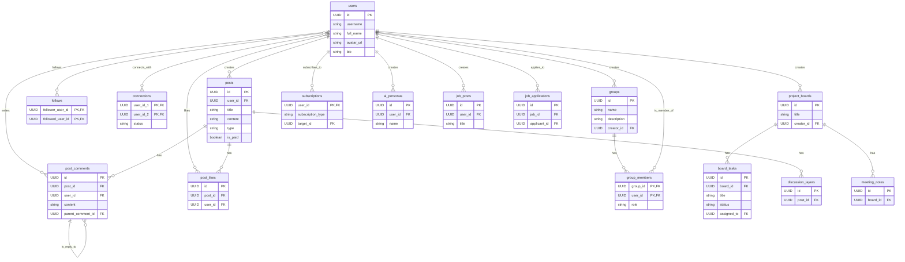

# Entity Relationship Analysis for SocialAize Platform

## 1. Introduction

This document provides a comprehensive analysis of the database entities and their relationships from the original `source_code` project. The goal is to define a clear and robust data model for the new, custom-built `SocialAize` platform.

The original database schema, built on Supabase, exhibits a high degree of complexity and some structural inconsistencies due to its iterative, "vibe-coded" development process. This analysis aims to distill the core business logic from the legacy schema into a coherent model.

## 2. Entity Relationship Diagram (ERD)

This Mermaid diagram visualizes the primary entities and their relationships. It serves as a high-level map of the platform's data structure.

## 3. Core Entities & Modules

The platform can be broken down into several core modules, each with its own set of entities.

### 3.1. User & Profile Module

This is the central module of the application.

*   **`users` (`auth.users`)**: The primary authentication table provided by Supabase. Contains user identity information like email and password.
*   **`profiles`**: This table extends the `auth.users` table and stores all public-facing profile information, such as username, bio, avatar URL, location, and social links. It also tracks aggregated stats like follower and post counts.

**Relationships:**
*   A `profile` has a one-to-one relationship with an `auth.users` record.
*   A `profile` can create many `posts`, `groups`, `project_boards`, etc.

### 3.2. Social & Content Module

This module handles all user-generated content and social interactions.

*   **`posts`**: Stores all primary content created by users, such as text posts, articles, and links to media. It includes fields for monetization (`is_paid`, `price_cents`) and visibility.
*   **`post_comments`**: Contains comments made on posts. It supports nested comments through a self-referencing `parent_comment_id`.
*   **`post_likes`**: A simple join table to track which users have liked which posts.
*   **`bookmarks`**: Tracks posts that users have saved for later.
*   **`discussion_layers` & `discussion_layer_responses`**: An advanced feature that allows for multiple, parallel discussion threads on a single post, categorized by topic (e.g., "Technical," "Political").

**Relationships:**
*   A `post` belongs to one `user` (or `page`).
*   A `post` can have many `post_comments` and `post_likes`.
*   A `post_comment` can have many replies (other `post_comments`).

### 3.3. Social Graph Module

This module defines the relationships between users.

*   **`follows`**: A many-to-many join table representing a unidirectional "follow" relationship, similar to Twitter.
*   **`connections`**: Represents a bidirectional "connection" relationship, similar to LinkedIn. It tracks the status of connection requests (`pending`, `accepted`).
*   **`subscriptions`**: A flexible table that allows users to subscribe to various entity types, including other users, topics (`subscription_topics`), or projects.

### 3.4. Groups & Pages Module

This module handles community and organizational entities.

*   **`groups`**: Allows users to create and join interest-based communities. Groups can be public or private.
*   **`group_members`**: A join table managing user membership and roles within groups (`admin`, `member`).
*   **`group_messages`, `group_events`, `group_announcements`, `group_resources`**: Tables dedicated to content and activities within a specific group.
*   **`pages`**: Allows users or organizations to create official brand or public figure pages.
*   **`page_followers`**: Tracks users who follow a `page`.

**Relationships:**
*   A `group` or `page` is created by a `user`.
*   `users` and `groups`/`pages` have a many-to-many relationship through `group_members`/`page_followers`.

### 3.5. Collaboration & Projects Module

This module is designed for project-based collaboration.

*   **`project_boards`**: The central entity for a project, acting as a workspace.
*   **`project_board_members`**: Manages user access and roles for a project board.
*   **`board_tasks`**: A simple task management system within a project board, with fields for status, priority, and assignment.
*   **`meeting_notes`**: Stores AI-generated summaries, action items, and transcripts from meetings related to a project.
*   **`collaborative_documents`**: A system for co-creating documents, linked to a post.

### 3.6. Job Marketplace Module

*   **`job_posts`**: Stores job listings created by users.
*   **`job_applications`**: Tracks applications submitted by users for job posts. Includes an AI-calculated `compatibility_score`.

### 3.7. Monetization Module

This module handles all payment-related features.

*   **`paid_content`**: Defines content that requires payment, such as a premium article or a subscription plan.
*   **`pricing_tiers`**: Allows for multiple pricing options for a single piece of `paid_content`.
*   **`post_purchases`**: Records one-time purchases of paid posts.
*   **`creator_subscriptions`**: Tracks recurring subscriptions from one user to another.
*   **`tips`**: Records one-time tips sent from one user to another for a specific post.

### 3.8. AI & Skills Module

*   **`ai_personas`**: Stores user-defined AI agents that can answer questions based on the user's content.
*   **`ai_persona_chats`**: Logs the conversation history with AI personas.
*   **`skills`**: A master list of all skills available on the platform.
*   **`user_skills`**: A join table linking users to skills, with an AI-calculated `proficiency_score`.

## 4. Key Observations & Recommendations

*   **Complexity**: The schema is very large and interconnected. For the new system, consider breaking this down into more manageable microservices or bounded contexts (e.g., Core Social, Projects, Jobs, Payments).
*   **RLS Hell**: The original schema has numerous complex Row Level Security (RLS) policies and helper functions. Many of the migrations are attempts to fix recursive loops in these policies. This is a major source of technical debt and should be re-architected carefully. A simpler, more robust authorization layer is critical.
*   **Redundancy**: There are multiple "chat" or "messaging" implementations (`rooms`/`messages`, `conversations`/`private_messages`, `group_messages`). These should be consolidated into a single, robust messaging system.
*   **JSONB Usage**: The schema uses `JSONB` columns extensively (e.g., `social_links`, `action_items`, `media_urls`). While flexible, this can make querying and data integrity difficult. Consider using proper relational tables for structured data where possible.
*   **AI Integration**: The AI features are tightly coupled with the database schema (e.g., `ai_persona_chats`, `user_skills`). The new architecture should maintain this link but perhaps through a more abstracted service layer.

This analysis provides a solid foundation for designing the new data model. The next step is to take these core entities and relationships and design a clean, scalable, and maintainable schema for the `SocialAize` platform.
