# Improved Entity & Functionality Design

This document outlines a series of recommended improvements to the original database schema and data model. The goal is to create a more robust, scalable, and maintainable foundation for the new SocialAize platform by addressing architectural issues found during the initial analysis.

## 1. Improved Entity Relationship Diagram (ERD)

This revised ERD reflects all proposed changes, including a unified messaging system, normalized tables, a standard authentication/authorization schema for Laravel, and a dedicated media management entity.

```mermaid
erDiagram
    %% --- Core User, Auth, & RBAC ---
    users {
        BIGINT id PK
        string name
        string email UK
        string password
        TIMESTAMPTZ email_verified_at
        TEXT avatar_url
        TEXT bio
        TEXT website
        TEXT location
        TIMESTAMPTZ created_at
        TIMESTAMPTZ updated_at
    }

    oauth_access_tokens {
        string id PK
        BIGINT user_id FK
        boolean revoked
        DATETIME expires_at
    }

    roles {
        BIGINT id PK
        string name UK
        string guard_name
    }

    permissions {
        BIGINT id PK
        string name UK
        string guard_name
    }

    model_has_roles {
        BIGINT role_id PK,FK
        string model_type PK
        BIGINT model_id PK,FK "user_id"
    }

    role_has_permissions {
        BIGINT permission_id PK,FK
        BIGINT role_id PK,FK
    }

    %% --- Media ---
    media {
        BIGINT id PK
        string model_type "Polymorphic: e.g., 'App\\Models\\User'"
        BIGINT model_id "Polymorphic: e.g., users.id"
        string collection_name "e.g., 'avatars', 'posts'"
        string file_name
        string mime_type
        string disk "e.g., 'minio'"
        BIGINT size
    }

    %% --- Content & Interactions ---
    content_nodes {
        UUID id PK
        BIGINT user_id FK
        UUID parent_id FK "Nullable, for replies"
        TEXT type "NOT NULL, e.g., 'post', 'article'"
        TIMESTAMPTZ created_at
    }

    post_content {
        UUID node_id PK,FK
        TEXT title "Nullable, for articles"
        TEXT content "NOT NULL"
    }

    poll_content {
        UUID node_id PK,FK
        TEXT question "NOT NULL"
    }

    poll_options {
        UUID id PK
        UUID node_id FK
        TEXT option_text "NOT NULL"
    }

    poll_votes {
        UUID option_id PK,FK
        BIGINT user_id PK,FK
    }

    content_likes {
        UUID node_id PK,FK
        BIGINT user_id PK,FK
    }

    bookmarks {
        UUID node_id PK,FK
        BIGINT user_id PK,FK
    }

    %% --- Messaging ---
    conversations {
        UUID id PK
        TEXT type "NOT NULL, 'direct' or 'group'"
        TEXT name "Nullable, for group convos"
        TIMESTAMPTZ created_at
    }

    conversation_participants {
        UUID conversation_id PK,FK
        BIGINT user_id PK,FK
        TEXT role "'admin' or 'member'"
    }

    messages {
        UUID id PK
        UUID conversation_id FK
        BIGINT sender_id FK
        TEXT content "NOT NULL"
        UUID reply_to_message_id FK "Nullable"
        TIMESTAMPTZ created_at
    }

    %% --- Social Graph ---
    follows {
        BIGINT follower_id PK,FK
        BIGINT following_id PK,FK
    }

    connections {
        BIGINT user_id_1 PK,FK
        BIGINT user_id_2 PK,FK
        TEXT status "'pending', 'accepted'"
        BIGINT requested_by FK
    }

    %% --- Relationships ---
    users ||--o{ oauth_access_tokens : "has"
    users }o--o{ model_has_roles : "has role"
    roles ||--o{ model_has_roles : "is assigned to"
    roles }o--o{ role_has_permissions : "has permission"
    permissions ||--o{ role_has_permissions : "is granted to"

    users ||--o{ content_nodes : "creates"
    content_nodes ||--o{ content_nodes : "is reply to"
    content_nodes ||--|{ post_content : "has"
    content_nodes ||--|{ poll_content : "has"
    poll_content ||--o{ poll_options : "has"
    poll_options ||--o{ poll_votes : "receives"
    users ||--o{ poll_votes : "casts"

    users ||..o{ media : "has (avatar)"
    content_nodes ||..o{ media : "has (attachment)"

    content_nodes }o--o{ content_likes : "is liked by"
    users ||--o{ content_likes : "likes"

    content_nodes }o--o{ bookmarks : "is bookmarked by"
    users ||--o{ bookmarks : "bookmarks"

    users ||--o{ messages : "sends"
    conversations ||--o{ messages : "has"
    users }o--o{ conversation_participants : "participates in"
    conversations }o--o{ conversation_participants : "has"

    users }o--o{ follows : "follows"
    users }o--o{ connections : "connects with"
```



## 2. Database Best Practices & Normalization

The following recommendations address key areas for improving the schema's structure and integrity.

### a. Consolidate Redundant Messaging Tables

*   **Problem:** The original schema has at least three separate systems for messaging (`rooms`/`messages`, `conversations`/`private_messages`, `group_messages`). This is highly redundant and complex.
*   **Suggestion:** Unify them into a single, robust messaging model.
    *   **`conversations`**: A central table for any chat thread. Add a `type` column (e.g., `'direct'`, `'group'`, `'project'`).
    *   **`conversation_participants`**: A single join table to link `users` to `conversations`.
    *   **`messages`**: A single table for all messages, with a `conversation_id` foreign key.

This normalized structure simplifies the entire feature. A user's inbox becomes a simple query for all conversations they participate in.

### b. Enforce Data Integrity and Normalize JSONB Fields

*   **Problem:** The schema has critical inconsistencies (e.g., `post_id` as `TEXT` in one table and `UUID` in another) and overuses JSONB for what should be relational data.
*   **Suggestion:**
    *   **Use Consistent Keys:** Ensure all foreign keys have the same data type as the primary key they reference.
    *   **Create Junction Tables:** Replace JSONB arrays with proper many-to-many relationships. For example, instead of `posts.media_urls`, create a `post_media` table:
      ```sql
      CREATE TABLE post_media (
          id UUID PRIMARY KEY,
          post_id UUID REFERENCES posts(id),
          url TEXT NOT NULL,
          type TEXT, -- 'image', 'video'
          sort_order INT
      );
      ```

### c. Refactor Polymorphic Associations

*   **Problem:** The `subscriptions` table uses a generic `target_id` and a `subscription_type` text column. This is an anti-pattern in relational databases because it prevents the use of foreign keys to enforce data integrity.
*   **Suggestion:** Create separate, explicit subscription tables.
    *   `user_subscriptions` (`subscriber_id`, `creator_id`)
    *   `topic_subscriptions` (`user_id`, `topic_id`)

This approach is more verbose but significantly more robust and easier to query safely.

## 3. Functionality & Data Model Improvements

These changes would make the platform's features more powerful and scalable.

### a. Unify the Content Model

*   **Problem:** The distinction between different content types (`posts`, `articles`, `polls`) is handled loosely by a `post_type` column, which can become difficult to manage.
*   **Suggestion:** Create a more generic, unified content model. A central **`content_nodes`** table could hold common fields (`id`, `user_id`, `type`, `parent_id`), with specific tables for each content type (`post_content`, `poll_content`) linking back to it. Tables like `content_likes` and `bookmarks` would then reference the central `content_nodes` table, simplifying interactions across all content types.

### b. Enhance the Tagging System

*   **Problem:** Using a simple text array for `posts.tags` makes it difficult to perform analytics, find related tags, or see a tag's popularity.
*   **Suggestion:** Implement a proper many-to-many relationship for tags.
    *   **`tags`** table (`id`, `name`).
    *   **`content_tags`** join table (`node_id`, `tag_id`).

This allows you to easily query for all posts with a certain tag and build features like "related tags."

### c. Redesign the Notification System

*   **Problem:** The `notifications` table uses multiple nullable foreign key columns (`post_id`, `event_id`, `comment_id`), which is inefficient and hard to extend.
*   **Suggestion:** Use a more structured approach.
    *   **`notifications`**: The core notification table (`id`, `recipient_id`, `type`, `is_read`).
    *   **`notification_context`**: A table to link the notification to its source without using multiple nullable columns.
      ```sql
      CREATE TABLE notification_context (
          notification_id UUID REFERENCES notifications(id),
          entity_type TEXT, -- 'post', 'comment', 'user'
          entity_id UUID
      );
      ```

By implementing these improvements, you will build a far more scalable, maintainable, and robust foundation for the `SocialAize` platform.

## 4. Detailed Schema Definitions

Here is a more detailed schema for the core entities, incorporating the recommended improvements.

### User & Profile Module

A clean, central table for user data.

```sql
-- users (replaces profiles, linked 1-to-1 with auth.users)
CREATE TABLE users (
    id BIGINT UNSIGNED PRIMARY KEY AUTO_INCREMENT, -- Laravel standard
    name VARCHAR(255) NOT NULL,
    email VARCHAR(255) UNIQUE NOT NULL,
    email_verified_at TIMESTAMPTZ NULL,
    password VARCHAR(255) NOT NULL,
    remember_token VARCHAR(100) NULL,
    avatar_url TEXT,
    cover_image_url TEXT,
    bio TEXT,
    website TEXT,
    location TEXT,
    created_at TIMESTAMPTZ NULL,
    updated_at TIMESTAMPTZ NULL
);
```
*   **Improvement:** This schema aligns with a standard Laravel `users` table while incorporating the profile fields. Statistics like `followers_count` should be calculated with queries (`SELECT COUNT(*) ...`) to prevent data synchronization issues.

### Content & Interaction Module

A unified approach to content makes interactions (likes, comments) much simpler.

```sql
-- A central table for all content "nodes"
CREATE TABLE content_nodes (
    id UUID PRIMARY KEY DEFAULT gen_random_uuid(),
    user_id BIGINT UNSIGNED NOT NULL REFERENCES users(id),
    parent_id UUID REFERENCES content_nodes(id), -- For comments/replies
    type TEXT NOT NULL, -- 'post', 'article', 'comment', 'poll'
    created_at TIMESTAMPTZ NOT NULL DEFAULT now(),
    updated_at TIMESTAMPTZ NOT NULL DEFAULT now()
);

-- Specific data for text posts or articles
CREATE TABLE post_content (
    node_id UUID PRIMARY KEY REFERENCES content_nodes(id) ON DELETE CASCADE,
    title TEXT, -- Mainly for articles
    content TEXT NOT NULL
);

-- Specific data for polls
CREATE TABLE poll_content (
    node_id UUID PRIMARY KEY REFERENCES content_nodes(id) ON DELETE CASCADE,
    question TEXT NOT NULL
);

CREATE TABLE poll_options (
    id UUID PRIMARY KEY DEFAULT gen_random_uuid(),
    node_id UUID NOT NULL REFERENCES poll_content(node_id) ON DELETE CASCADE,
    option_text TEXT NOT NULL
);

CREATE TABLE poll_votes (
    option_id UUID NOT NULL REFERENCES poll_options(id),
    user_id BIGINT UNSIGNED NOT NULL REFERENCES users(id),
    PRIMARY KEY (option_id, user_id)
);

-- Unified interactions
CREATE TABLE content_likes (
    node_id UUID NOT NULL REFERENCES content_nodes(id),
    user_id BIGINT UNSIGNED NOT NULL REFERENCES users(id),
    PRIMARY KEY (node_id, user_id)
);

CREATE TABLE bookmarks (
    node_id UUID NOT NULL REFERENCES content_nodes(id),
    user_id BIGINT UNSIGNED NOT NULL REFERENCES users(id),
    PRIMARY KEY (node_id, user_id)
);
```
*   **Improvement:** This is a more normalized and scalable approach than a single `posts` table with many nullable columns. Liking, bookmarking, or commenting on *any* type of content becomes a single, consistent action pointing to `content_nodes.id`.

### Social Graph Module

Clear, explicit tables for relationships.

```sql
-- Unidirectional follow
CREATE TABLE follows (
    follower_id BIGINT UNSIGNED NOT NULL REFERENCES users(id),
    following_id BIGINT UNSIGNED NOT NULL REFERENCES users(id),
    PRIMARY KEY (follower_id, following_id)
);

-- Bidirectional connection
CREATE TABLE connections (
    user_id_1 BIGINT UNSIGNED NOT NULL REFERENCES users(id),
    user_id_2 BIGINT UNSIGNED NOT NULL REFERENCES users(id),
    status TEXT NOT NULL DEFAULT 'pending', -- 'pending', 'accepted'
    requested_by BIGINT UNSIGNED NOT NULL REFERENCES users(id),
    PRIMARY KEY (user_id_1, user_id_2)
);
```
*   **Improvement:** This structure is clean and standard for social graphs. The composite primary keys enforce integrity.

### Messaging Module

A single, unified system for all chat types.

```sql
CREATE TABLE conversations (
    id UUID PRIMARY KEY DEFAULT gen_random_uuid(),
    type TEXT NOT NULL, -- 'direct', 'group'
    name TEXT, -- For group conversations
    created_at TIMESTAMPTZ NOT NULL DEFAULT now()
);

CREATE TABLE conversation_participants (
    conversation_id UUID NOT NULL REFERENCES conversations(id),
    user_id BIGINT UNSIGNED NOT NULL REFERENCES users(id),
    role TEXT DEFAULT 'member', -- 'admin', 'member'
    PRIMARY KEY (conversation_id, user_id)
);

CREATE TABLE messages (
    id UUID PRIMARY KEY DEFAULT gen_random_uuid(),
    conversation_id UUID NOT NULL REFERENCES conversations(id),
    sender_id BIGINT UNSIGNED NOT NULL REFERENCES users(id),
    content TEXT NOT NULL,
    reply_to_message_id UUID REFERENCES messages(id), -- For threaded replies
    created_at TIMESTAMPTZ NOT NULL DEFAULT now()
);
```
*   **Improvement:** This eliminates all the redundant chat tables from the original schema, making the messaging backend much simpler and more powerful.

### Media Module

To handle file uploads to MinIO or any other filesystem, it's best to have a dedicated `media` table. This table stores metadata about the files, while the files themselves live in the object storage. This approach is used by popular Laravel packages like `spatie/laravel-medialibrary`.

```sql
CREATE TABLE media (
    id BIGINT UNSIGNED NOT NULL AUTO_INCREMENT,
    model_type VARCHAR(255) NOT NULL,
    model_id BIGINT UNSIGNED NOT NULL,
    uuid UUID UNIQUE NOT NULL,
    collection_name VARCHAR(255) NOT NULL, -- e.g., 'avatars', 'post_images'
    name VARCHAR(255) NOT NULL, -- Original filename for display
    file_name VARCHAR(255) NOT NULL, -- Stored filename (e.g., with hash)
    mime_type VARCHAR(255) NULL,
    disk VARCHAR(255) NOT NULL, -- 'minio', 's3', 'local'
    size BIGINT UNSIGNED NOT NULL,
    manipulations JSON,
    custom_properties JSON,
    generated_conversions JSON,
    responsive_images JSON,
    order_column INT UNSIGNED NULL,
    created_at TIMESTAMPTZ NULL,
    updated_at TIMESTAMPTZ NULL,
    PRIMARY KEY (id),
    INDEX (model_type, model_id)
);
```
*   **Improvement:** This provides a single, polymorphic table to manage all media. You can attach files to any model (User, Post, Message) by setting the `model_type` and `model_id`. This is far more flexible and powerful than storing URLs in text fields.

## 5. Authentication & Authorization (Laravel Passport & RBAC)

To support a robust admin section and user roles, the database needs tables for authentication tokens and Role-Based Access Control (RBAC). This model is based on Laravel Passport and the popular `spatie/laravel-permission` package.

### a. Laravel Passport Tables

Laravel Passport will automatically create several `oauth_*` tables to manage OAuth2 clients, access tokens, and refresh tokens. The most relevant table for our diagram is `oauth_access_tokens`, which links a token to a user.

*   **`oauth_access_tokens`**: Stores the generated access tokens. The `user_id` column creates a one-to-many relationship, as one user can have multiple valid access tokens.

### b. Role-Based Access Control (RBAC) Tables

This set of tables provides a flexible way to manage user permissions.

*   **`roles`**: A simple table to define roles (e.g., `admin`, `moderator`, `member`).
*   **`permissions`**: Defines specific actions a user can take (e.g., `delete-posts`, `edit-users`).
*   **`model_has_roles`**: A polymorphic many-to-many table that assigns roles to users. This links a `user` to a `role`.
*   **`role_has_permissions`**: A many-to-many table that assigns permissions to roles.

This structure allows you to grant many permissions to a single role and assign that role to many users, providing a clean and scalable way to manage authorization.

### SQL Definitions for RBAC

```sql
CREATE TABLE roles (
    id BIGINT UNSIGNED NOT NULL AUTO_INCREMENT,
    name VARCHAR(255) NOT NULL,
    guard_name VARCHAR(255) NOT NULL,
    created_at TIMESTAMPTZ NULL,
    updated_at TIMESTAMPTZ NULL,
    PRIMARY KEY (id),
    UNIQUE (name, guard_name)
);

CREATE TABLE permissions (
    id BIGINT UNSIGNED NOT NULL AUTO_INCREMENT,
    name VARCHAR(255) NOT NULL,
    guard_name VARCHAR(255) NOT NULL,
    created_at TIMESTAMPTZ NULL,
    updated_at TIMESTAMPTZ NULL,
    PRIMARY KEY (id),
    UNIQUE (name, guard_name)
);

CREATE TABLE model_has_roles (
    role_id BIGINT UNSIGNED NOT NULL,
    model_type VARCHAR(255) NOT NULL,
    model_id BIGINT UNSIGNED NOT NULL,
    PRIMARY KEY (role_id, model_id, model_type),
    INDEX (model_id, model_type),
    FOREIGN KEY (role_id) REFERENCES roles(id) ON DELETE CASCADE
);

CREATE TABLE role_has_permissions (
    permission_id BIGINT UNSIGNED NOT NULL,
    role_id BIGINT UNSIGNED NOT NULL,
    PRIMARY KEY (permission_id, role_id),
    FOREIGN KEY (permission_id) REFERENCES permissions(id) ON DELETE CASCADE,
    FOREIGN KEY (role_id) REFERENCES roles(id) ON DELETE CASCADE
);
```

```